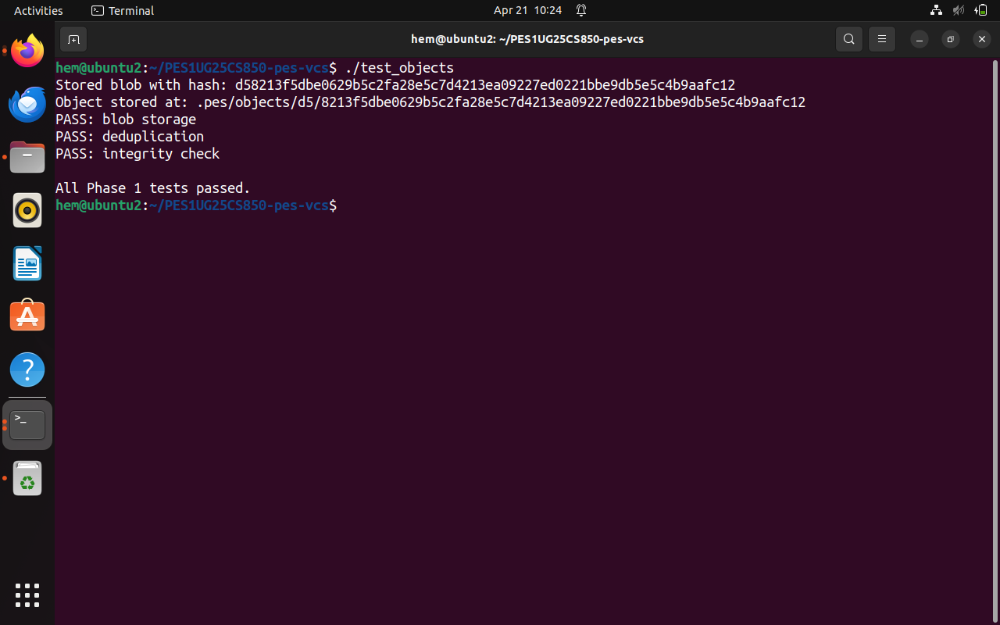
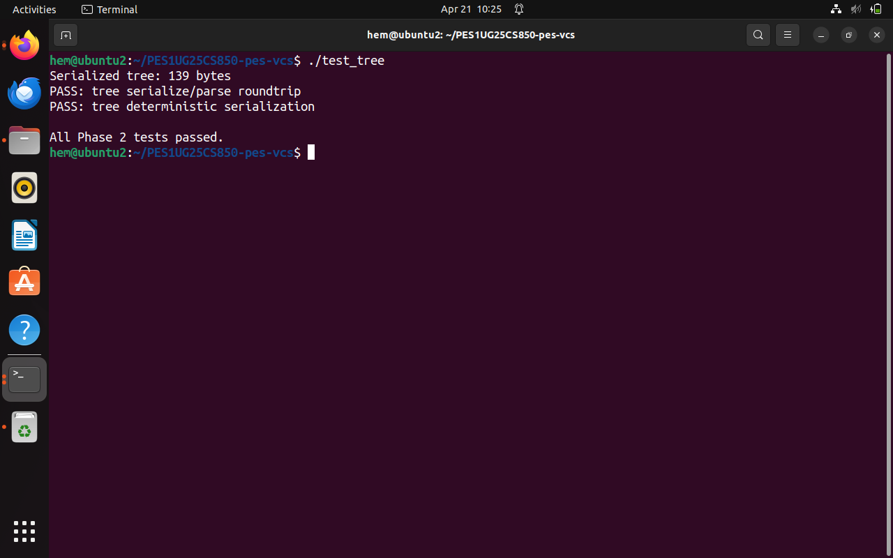
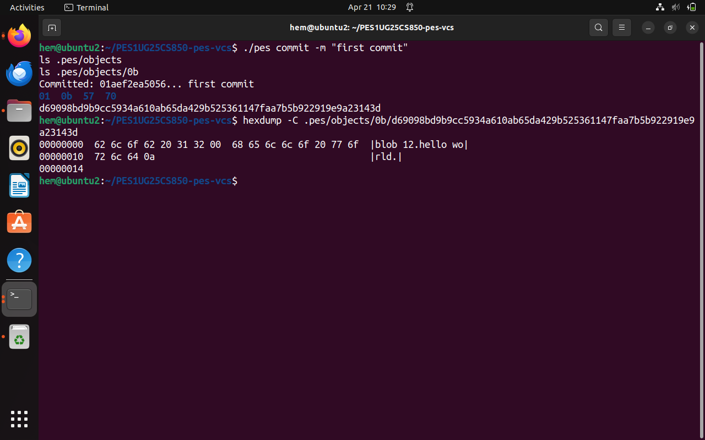
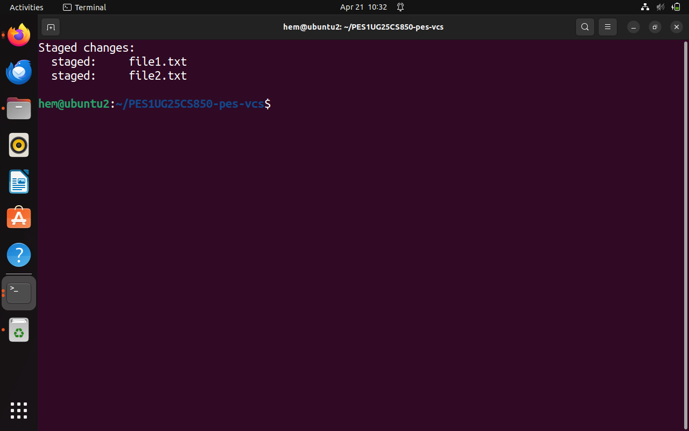
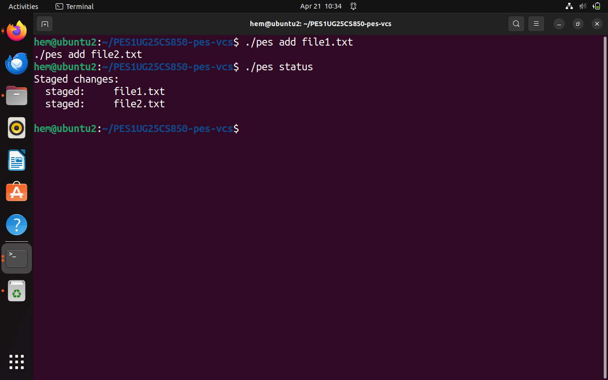
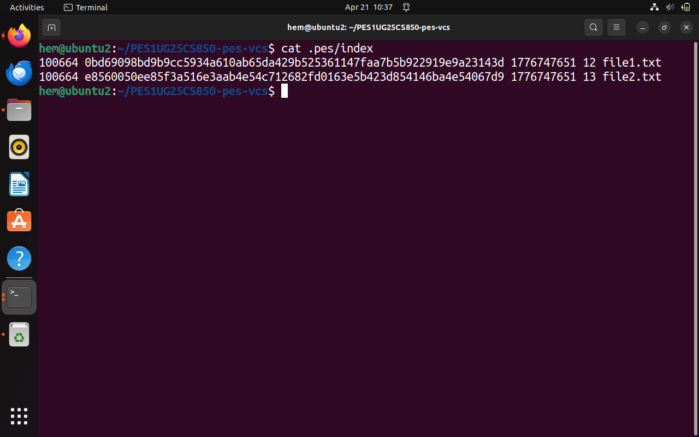
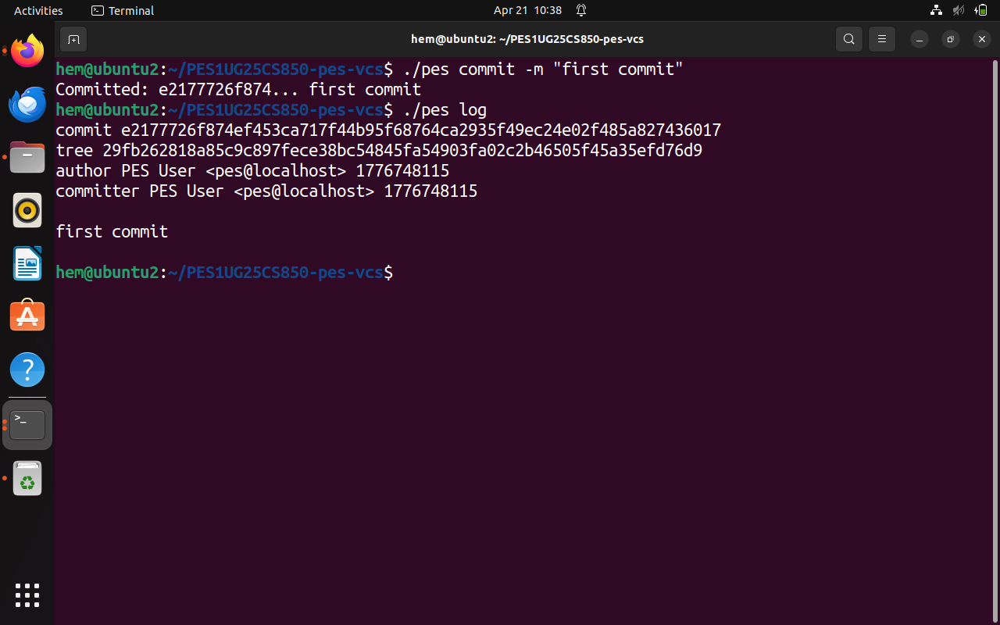
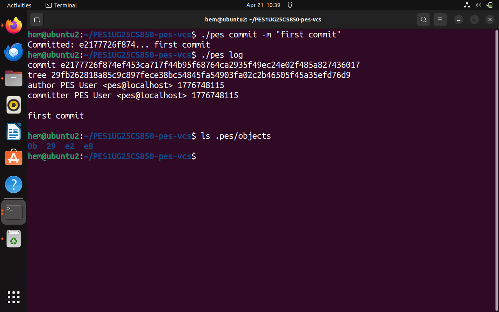

# PES Version Control System (PES-VCS)

## Overview

PES-VCS is a simplified Git-like version control system implemented in C. It demonstrates how version control systems manage files, directories, and history using content-addressable storage.

---

## Features

* Repository initialization
* File staging (index)
* Object storage using SHA-256 hashing
* Tree structure creation
* Commit and log functionality

---

## Technologies Used

* C Programming
* OpenSSL (libcrypto)
* Linux

---

## Project Structure

```
.
├── pes.c / pes.h
├── object.c
├── index.c
├── tree.c
├── commit.c
├── test_objects.c
├── test_tree.c
├── Makefile
├── screenshots/
└── README.md
```

---

## Execution Steps

### Compile

```
make
```

### Run Phase 1

```
./test_objects
```

### Run Phase 2

```
./test_tree
```

### Initialize Repository

```
./pes init
```

### Add Files

```
./pes add file1.txt
./pes add file2.txt
```

### Check Status

```
./pes status
```

### Commit Changes

```
./pes commit -m "first commit"
```

### View Log

```
./pes log
```

---

## Screenshots

### Phase 1: Object Storage



---

### Phase 2: Tree Structure



---

### Phase 2: Object Hex Dump



---

### Phase 3: Status Before Adding



---

### Phase 3: Staged Files



---

### Phase 3: Index Content



---

### Phase 4: Commit Log



---

### Phase 4: Object Growth



---

## Internal Working

* Files are stored as SHA-256 hashed objects
* Objects are organized as `.pes/objects/<prefix>/<hash>`
* Index acts as staging area
* Trees represent directory structure
* Commits store metadata and history

---

## Author

Tejas  Gowda
PES University
