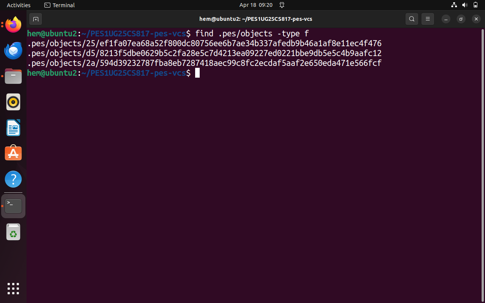
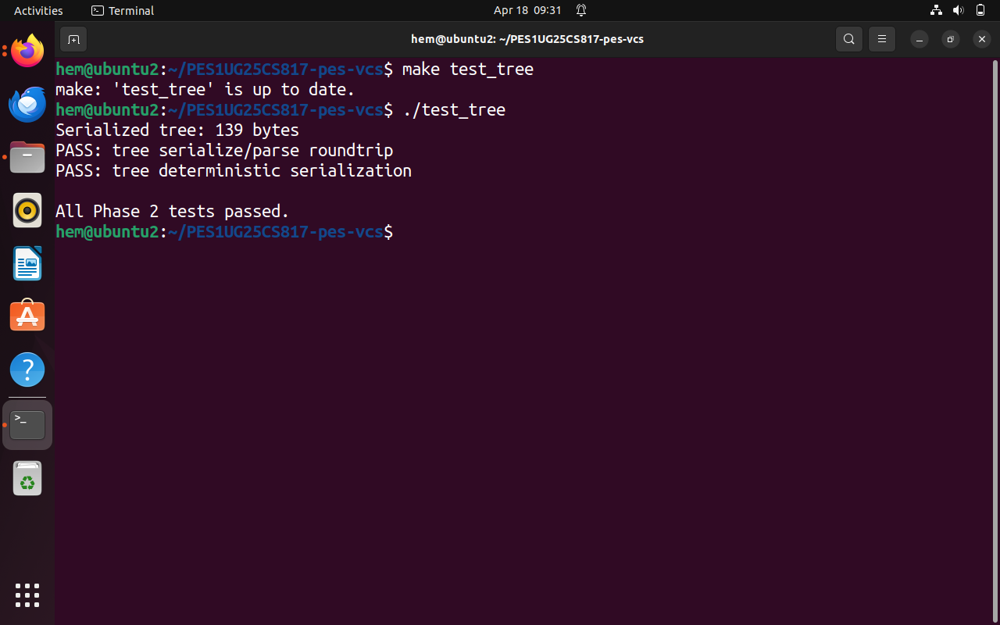
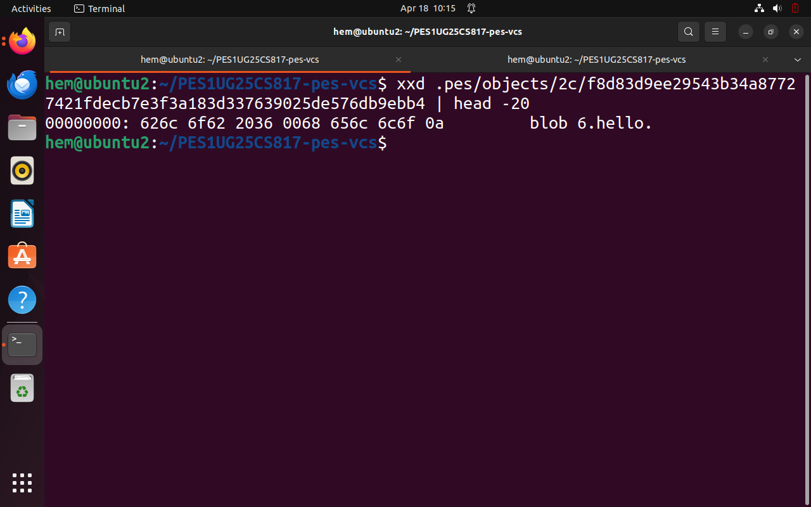
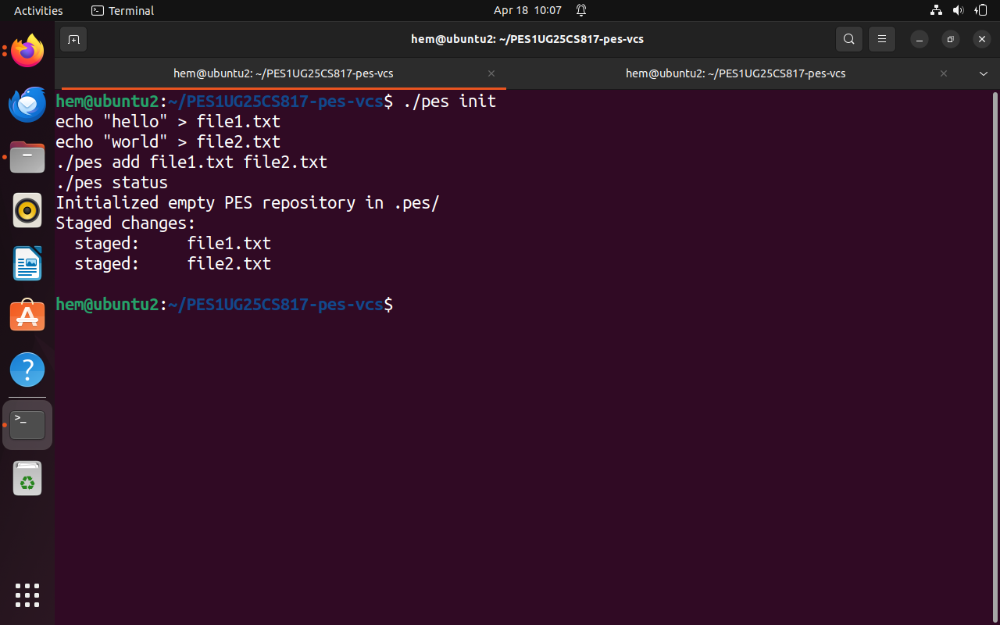
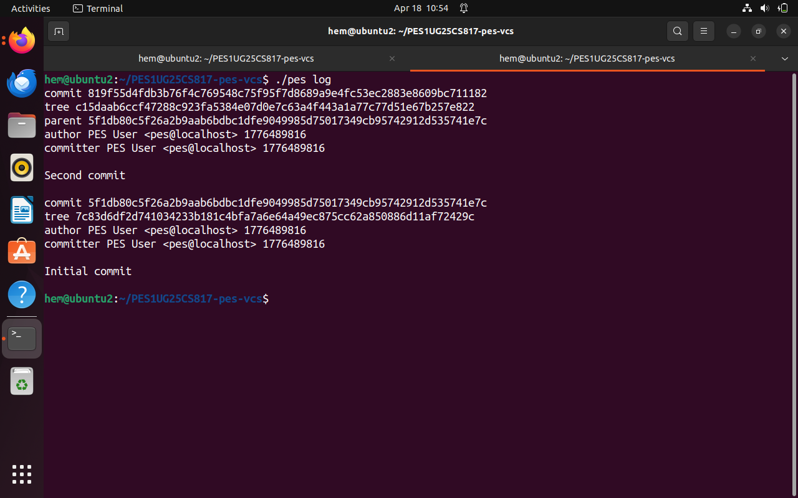
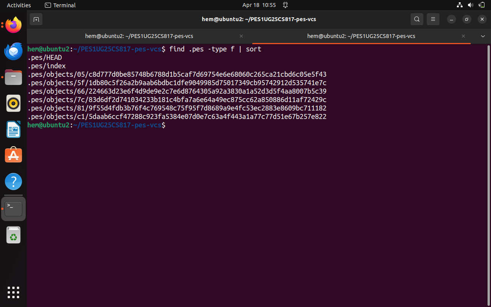
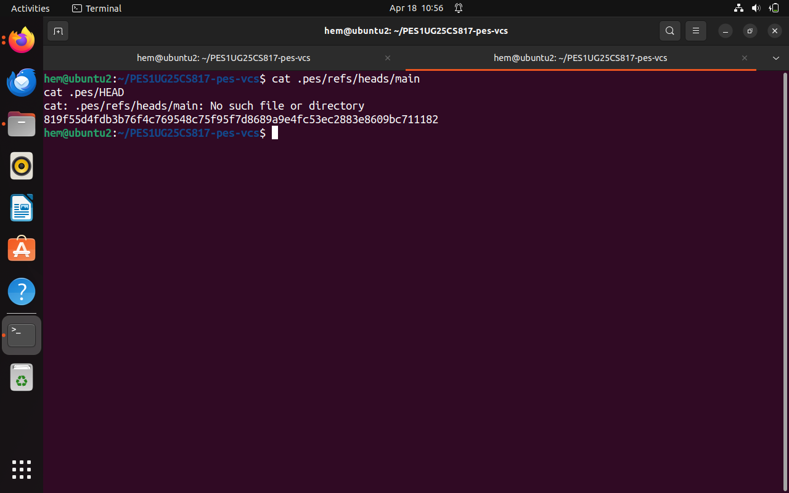

# PES Version Control System (PES-VCS)

## Overview

This project is a simplified implementation of a Git-like version control system developed as part of the lab exercise. The goal of this project was to understand how version control systems internally manage data such as files, directories, and commits using content-addressable storage.

The system supports basic functionalities such as adding files, creating commits, and viewing commit history.

---

## Features Implemented

* Object storage using SHA-256 hashing
* Blob, Tree, and Commit object handling
* Index (staging area) management
* Commit creation with parent linking
* Commit history (log) traversal

---

## Phase-wise Implementation

### Phase 1: Object Storage

In this phase, we implemented the core object storage system:

* Files are stored as blob objects
* Each object is identified using a SHA-256 hash
* Objects are stored inside `.pes/objects/`

---

### Phase 2: Tree Structure

* Tree objects were created to represent directory structures
* Each tree stores file metadata (mode, name, hash)
* Serialization and parsing of tree objects were implemented

---

### Phase 3: Index (Staging Area)

* Implemented an index file (`.pes/index`)
* Supports:

  * Adding files (`pes add`)
  * Saving and loading index entries
* Acts as an intermediate stage before committing

---

### Phase 4: Commit System

* Implemented commit creation with:

  * Tree reference
  * Parent commit linkage
  * Author and timestamp
* Implemented `pes log` to traverse commit history

---

## Screenshots

### Phase 1

#### 1A - Test Objects

#### 1B - Object Store

---

### Phase 2

#### 2A - Tree Test

#### 2B - Tree Object Hex

---

### Phase 3

#### 3A - PES Status

#### 3B - Index File

---

### Phase 4

#### 4A - PES Log

#### 4B - Object Growth

#### 4C - References

---

## Key Concepts Learned

* Content-addressable storage
* Difference between blob, tree, and commit objects
* How Git internally tracks changes
* Importance of staging area (index)
* Parent-child relationship between commits

---

## Challenges Faced

* Handling segmentation faults due to incorrect memory usage
* Understanding object serialization formats
* Debugging function mismatches (especially object_write)
* Managing correct data flow between index → tree → commit

---

## Conclusion

This project provided a strong understanding of how version control systems like Git function internally. By building each component step-by-step, it became clear how data is stored, tracked, and retrieved efficiently.

---

## GitHub Repository

[Add your GitHub link here]

---

## Author

Hemanth Gowda
PES University
